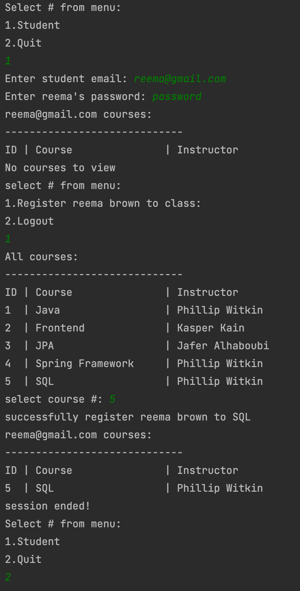

## School Management System

### Overview
This project implements a School Management System where students can register for courses, view the courses they are assigned to, and more. The system ensures that only valid students can log in with the correct credentials, while also allowing students to register for courses if they aren't already registered.

### Work-Flow:
Only students with the right credentials can log in.
Otherwise, a message is displayed stating: “Wrong Credentials”.
Valid students are able to see the courses they are registered for.
Valid students are able to register for any course in the system as
long as they are not already registered.

### Maven Project Requirements:

- [Amazon Corretto 17 JDK](https://docs.aws.amazon.com/corretto/latest/corretto-17-ug/downloads-list.html) 
- [Hibernate](https://mvnrepository.com/artifact/org.hibernate/hibernate-core)
- [MySQL Connector Java](https://mvnrepository.com/artifact/mysql/mysql-connector-java)
- [Project lombok](https://mvnrepository.com/artifact/org.projectlombok/lombok)
- [Junit jupiter api](https://mvnrepository.com/artifact/org.junit.jupiter/junit-jupiter-api)
- [Junit jupiter engine](https://mvnrepository.com/artifact/org.junit.jupiter/junit-jupiter-engine)
- [Junit jupiter param](https://mvnrepository.com/artifact/org.junit.jupiter/junit-jupiter-params)
- [Junit platform suite](https://mvnrepository.com/artifact/org.junit.platform/junit-platform-suite-engine)
- [Junit platform runner](https://mvnrepository.com/artifact/org.junit.platform/junit-platform-runner)

### Setup

1. Clone Repo: `https://github.com/mshahcode/CoreJava-Hibernate-JUnit-Project.git`
2. Open cloned repo in your IDE
3. Build the project using maven: `mvn clean install`
4. Run compiled project and follow terminal instructions

### Database Entities
##### Student (`@Table(name = "student")`)
| Field    | Datatype     | Description                 | Database attributes `@Column()`                                                                                                                                                                                        | 
|----------|--------------|-----------------------------|------------------------------------------------------------------------------------------------------------------------------------------------------------------------------------------------------------------------|
 | email    | String       | Student’s unique identifier | Primary key, 50 character limit, name `email`                                                                                                                                                                          |
 | name     | String       | Student’s name              | 50 character limit, not null, name `name`                                                                                                                                                                              |
 | password | String       | Student’s password          | 50 character limit not null, name `password`                                                                                                                                                                           |
 | courses  | Set\<Course> | Student courses list        | Join table strategy name `student_courses` , name of student primary key column `student_email` and inverse primary key (courses) column `courses_id` , fetch type `EAGER`, cascade type `DETACH,REMOVE,MERGE,PERSIST` |

##### Course (`@Table(name = "course")`):

| Field      | Datatype      | Description              | Database attributes `@Column()`                                                    | 
|------------|---------------|--------------------------|------------------------------------------------------------------------------------|
| id         | int           | Course unique identifier | Primary key , generation type `IDENTITY`,                                          |
| name       | String        | Course name              | 50 character limit, not null                                                       |
| instructor | String        | Instructor name          | 50 character limit not null                                                        |
| students   | Set\<Student> | Course learners list     | fetch type `EAGER`, cascade type `DETACH,REMOVE,MERGE,PERSIST`, mappedBy `courses` | 

---
#### Data Access Object Design:

##### StudentI:

| Abstract method         | Return type    | Parameters                    | Description                                                                                                     | 
|-------------------------|----------------|-------------------------------|-----------------------------------------------------------------------------------------------------------------|
| createStudent           | void           | Student                       | persist student to database, also handle commit,rollback, and exceptions                                        |
| getAllStudents          | List\<Student> | None                          | return all students from database, also handle commit,rollback, and exceptions                                  |
| getStudentByEmail       | Student        | String email                  | return student if exists, also handle commit,rollback, and exceptions                                           |
| validateStudent         | boolean        | String email, String password | match email and password to database to gain access to courses, also handle commit,rollback, and exceptions     |
| registerStudentToCourse | void           | String email, int courseId    | register a course to a student (collection to prevent duplication), also handle commit,rollback, and exceptions |
| getStudentCourses       | List\<Course>  | String email                  | get all the student courses list (use native query), also handle commit,rollback, and exceptions                | 

##### CourseI:

| Abstract method         | Return type   | Parameters                    | Description                                                                                                     | 
|-------------------------|---------------|-------------------------------|-----------------------------------------------------------------------------------------------------------------|
| createCourse            | void          | Course                        | persist course to database, also handle commit,rollback, and exceptions                                         |
| getAllCourses           | List\<Course> | None                          | return all courses from database, also handle commit,rollback, and exceptions                                   |
| getCourseById           | Course        | int courseId                  | return course if exists, also handle commit,rollback, and exceptions                                            |
---

#### Workflow example

